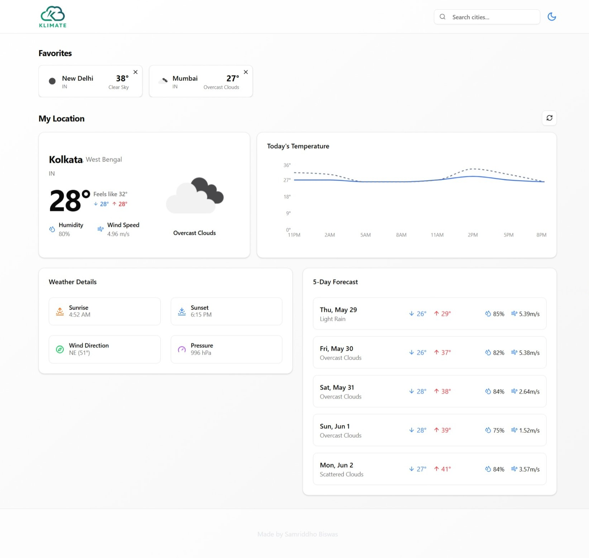

# 🌤️ Klimate - Weather Forecast App

Klimate is a real-time weather forecast application built with modern web technologies. It provides current weather conditions, a 5-day forecast, and hourly temperature trends using the OpenWeatherMap API.

 
 

## 🚀 Features

- 🌍 Add and view multiple favorite locations
- 🌦️ Real-time weather info: temperature, humidity, wind speed, etc.
- 📈 Hourly temperature chart using Recharts
- 📅 5-day forecast with detailed metrics
- 🌗 Sunrise and sunset times
- 🌓 Light/Dark mode toggle for user preference

---

## 🌐 Live Demo

[🔗 Demo Link](https://your-demo-link.com) 

---

## 🛠️ Built With

- [React](https://reactjs.org/)
- [TypeScript](https://www.typescriptlang.org/)
- [Vite](https://vitejs.dev/)
- [Tailwind CSS](https://tailwindcss.com/)
- [ShadCN UI](https://ui.shadcn.com/)
- [TanStack Query (React Query)](https://tanstack.com/query/latest)
- [Recharts](https://recharts.org/en-US/)
- [OpenWeatherMap API](https://openweathermap.org/api)

---


## 📦 Getting Started

### 1. Clone the repository

```bash
git clone https://github.com/yourusername/klimate.git
cd klimate
```

### 2. Install dependencies

```bash
npm install
# or
yarn install
```

### 3. Add your OpenWeatherMap API key

Create a `.env` file in the root:

```env
VITE_WEATHER_API_KEY=your_openweather_api_key
```

### 4. Run the development server

```bash
npm run dev
# or
yarn dev
```

---

## 📂 Project Structure

```bash
klimate/
│
├── public/                 # Static files
├── src/
│   ├── api/                # API calls
│   ├── components/         # Reusable UI components
│   ├── context/            # React Context API logic
│   ├── hooks/              # Custom React hooks
│   ├── lib/                # Utility functions
│   ├── pages/              # Page-level components
│   ├── App.tsx             # Root App component
│   └── main.tsx            # Application entry point
│
├── .env                    # Environment variables
├── index.html              # HTML template
├── package.json            # Project metadata and dependencies
├── tailwind.config.js      # Tailwind config
├── vite.config.ts          # Vite configuration
└── README.md               # You're here!
```

---

## 📸 Screenshot



---
